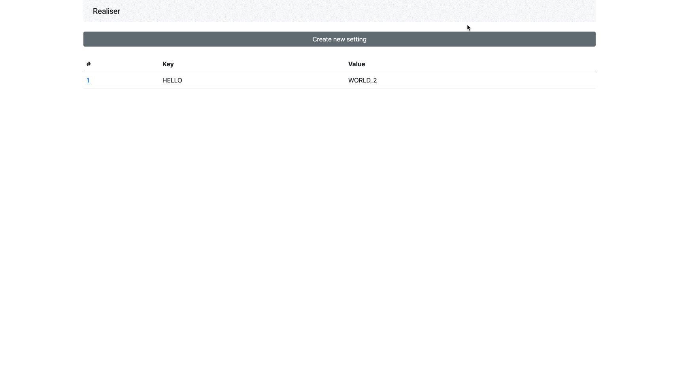

<p align="center">
  <a href="#" target="_blank" rel="noopener noreferrer">
    
  </a>
</p>

# Realiser
The Rails engine will help you to provides the setting data to your app. See the demo engine in [here](https://github.com/philiplambok/demo-realiser).

## Installation
Add this line to your application's Gemfile:

```ruby
gem 'realiser'
```

And then execute:
```bash
$ bundle
```

Or install it yourself as:
```bash
$ gem install realiser
```

After that, run this command to generate the migration files:

```sh
$ bundle exec rails g realiser install
$ bundle exec rake db:migrate
```

Then, you can enable the Web UI, with mount the engine in your `config/routes.rb`:

```rb
Rails.application.routes.draw do
  mount Realiser::Engine => '/realiser'
end
```

Then, add this line to your `app/assets/config/manifest.js` to help compile the stylesheets.

```js
//= link realiser/application.css
```

Done, you can manage the settings data by visiting the path `/realiser`.

The UI will be something like this:



## Usage

You can access your setting by calling them like this:

```rb
Realiser::Setting['PAYMENT_TOKEN'] #> 'sgFadLoRx5rX1VL02OalMQ' 
```

Honesly, the `Realiser::Setting` object is inherit from `ActiveRecord::Base`, so you can also show the value with something like this:

```rb
Realiser::Setting.find_by(key: 'PAYMENT_TOKEN').value #> 'sgFadLoRx5rX1VL02OalMQ' 
```

By inheriting the object with the active record object, I hope you can more flexible when want to use the setting object.

If you thing `Realiser::Setting` is too long, you can also make them short with creating new class like this:

```rb
# app/models/setting.rb
class Setting < Realiser::Setting
end
```

So can use like this:

```rb
Setting['PAYMENT_TOKEN'] #> 'sgFadLoRx5rX1VL02OalMQ' 
```

## Contributing
PR are welcome! 

You can use [the issue tab](https://github.com/philiplambok/realiser/issues) for asking me a question about this engine, or report a bug, or even to request a feature.

## License
The gem is available as open source under the terms of the [MIT License](https://opensource.org/licenses/MIT).
